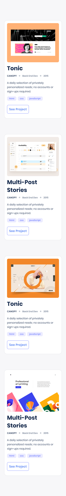

# Portfolio: mobile version

## Learning objectives
- Understand how to parse a Figma design to create a UI.
- Use industry-standard tools (Flexbox) to place elements in the page.
- Use industry-standard tools (CSS Grid) to place elements in the page.
- Build a personal portfolio site.

### Estimated time: 3h

## Description
For the second milestone in building your portfolio website, you will create the mobile website section where you will list your portfolio projects.

*IMPORTANT NOTE: Read **all** requirements before you start building your project.*

### General requirements

- Make sure that there are [no linter errors](https://github.com/microverseinc/linters-config):
    - Linter should be set up correctly for this repository.
    - Linter result should be green.
    - There should be no custom changes to linter config.
- Make sure that you used correct [GitHub Flow](https://github.com/microverseinc/curriculum-transversal-skills/blob/main/git-github/articles/github_flow.md):
    - README file should be descriptive.
    - Commit messages should be meaningful.
    - Pull Request should have a descriptive title telling you what changes are inside.
    - Pull Request should have a short summary describing introduced changes in more detail.
- Make sure that you documented your work [in a professional way](https://github.com/microverseinc/curriculum-transversal-skills/blob/main/documentation/articles/professional_repo_rules.md):
    - Branch should describe a feature or action (e.g. 'created_sidebar' or 'added_comments_section').
    - Pull Request is made from 'feature branch' into the `main` branch.

### HTML/CSS requirements

- Follow our list of [best practices for HTML & CSS](https://github.com/microverseinc/curriculum-html-css/blob/main/articles/html_css_best_practices.md).

### Project  requirements

- Now you will build the middle section of the mobile website. We included a screenshot of Template 1 below for reference, but you should stick to the template that you chose. This section of the mobile website should include:
    -  "Works" section
      

       
      

      
- In order to lay out the elements on the page you should **use CSS Grid and Flexbox** combined (it is mandatory that you use both). Use CSS Grid in the main container that contains all of the cards and use Flexbox to lay out an individual card.
- You don't need to implement the detail modal window that requires JavaScript.
- You must stick to the design as much as possible (e.g., font, colors, images, tests, margins) using [the templates in Figma](https://www.figma.com/file/l7SqJ3ZfkAKih9sFxvWSR4/Microverse-Student-Project-1?node-id=0%3A1).
- Implement the button interactions (enable, hover, etc.).

### Need a big picture?

Remind me about [the big picture of this project](./sneak_peek.md).

## Code review

Follow [these steps](https://github.com/microverseinc/curriculum-transversal-skills/blob/main/code-review/articles/how_to_ask_for_a_code_review.md) to request a code review of your project.

## Submit your project

After the final approval from a code reviewer, you need to submit your project.
[Read this FAQ for a reminder on how to submit your project.](https://microverse.zendesk.com/hc/en-us/articles/360061344234)
Now go to your Student Dashboard and submit your project.

 
