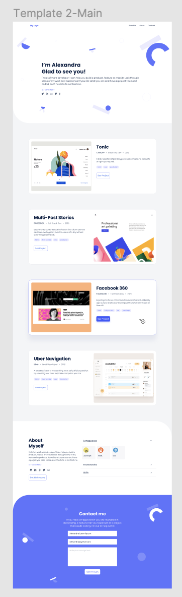

# Portfolio: desktop version

## Learning objectives
- Understand  how to create UIs adaptable to different screen sizes using media queries.
- Understand how to parse a Figma design to create a UI.

### Estimated time: 8.5h

## Description

For the fourth project in your portfolio website, you will:

- Use media queries to make sure that your website displays correctly on desktop screens.

*IMPORTANT NOTE: Read **all** requirements before you start building your project.*

### General requirements

- Make sure that there are [no linter errors](https://github.com/microverseinc/linters-config).
- Make sure that you used correct ([Github flow](https://github.com/microverseinc/curriculum-transversal-skills/blob/main/git-github/articles/github_flow.md).
- Make sure that you documented your work [in a professional way](https://github.com/microverseinc/curriculum-transversal-skills/blob/main/documentation/articles/professional_repo_rules.md).

### HTML/CSS requirements

- Follow our list of [best practices for HTML & CSS](https://github.com/microverseinc/curriculum-html-css/blob/main/articles/html_css_best_practices.md).

### Project requirements

- You need to make sure that your dekstop version looks like the one in the Figma design template that you chose. We include a screenshot of Template 1 below for reference, but you should use the template that you chose.
- **IMPORTANT NOTE** some Figma design templates include two input fields (for first name and last name) in the desktop version and one input field (for full name) in the mobile version. **Please ignore this part of the design template and use only one input for the full name for all versions.**
    

     
    

- Use media queries in your CSS file to make your desktop version look like the template you selected.
- In order to lay out the elements on the page you should use Grid and Flexbox.
- You don't need to implement any functionality that requires JavaScript.
- You must replicate the design as much as possible (e.g., font, colors, images, tests, margins) using [the info from the Figma templates](https://www.figma.com/file/l7SqJ3ZfkAKih9sFxvWSR4/Microverse-Student-Project-1?node-id=0%3A1).

### Need a big picture?

Remind me about [the big picture of this project](./sneak_peek.md).

## Code review

Follow [these steps](https://github.com/microverseinc/curriculum-transversal-skills/blob/main/code-review/articles/how_to_ask_for_a_code_review.md) to request a code review of your project.

## Submit your project

After the final approval from a code reviewer, you need to submit your project.
[Read this FAQ for a reminder on how to submit your project.](https://microverse.zendesk.com/hc/en-us/articles/360061344234)
Now go to your Student Dashboard and submit your project.

 
