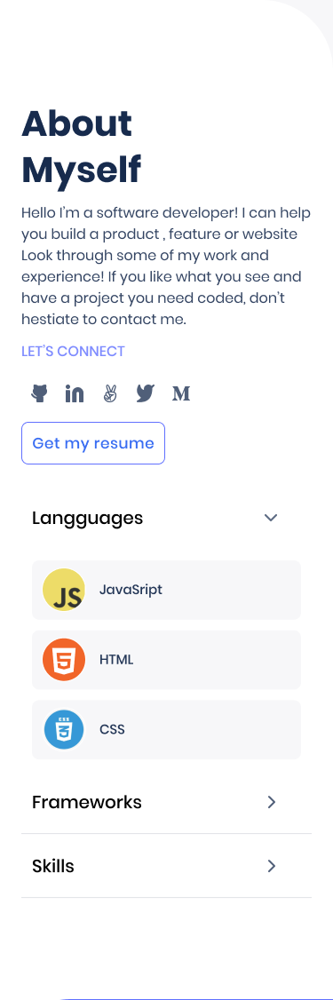

# Milestone 1 - Setup and mobile version skeleton

## Learning objectives
- Understand how to parse a Figma design to create a UI.
- Use industry-standard tools (flexbox) to place elements in the page.
- Build a personal portfolio site.
- Use images and backgrounds to enhance the look of the website.

### Estimated time: 2.5h

## Description
In this first milestone of your portfolio website, you will 
- set up a new repository and prepare it for development using best practices (e.g., linters)
- create the first sections of the mobile website

### Requirements

#### General requirements
You need to follow the best practices about code standards and repository that you learned in the previous project:
- Linters
  - Linter should be set up correctly for this repository.
  - Linter result should be green
  - There should be no custom changes to linter config
- Professional repository
  - README file should be descriptive
  - Commit messages should be meaningful
  - Pull Request should have a descriptive title telling you what changes are inside.
  - Pull Request should have a short summary describing introduced changes in more details.
- GitHub flow
  - Branch should have a name of a feature or action (e.g. 'created_sidebar' or 'added_comments_section')
  - Pull Request is made from “feature branch” into the `main` branch

#### HTML/CSS requirements
In all the HTML/CSS projects you should follow these guidelines:
- Follow the best practices in this [HTML style guide](https://www.w3schools.com/html/html5_syntax.asp)
- Use the appropriate tags for each element (e.g., links, titles, etc.) and use HTML5 semantic tags (e.g., header, nav) over `div`s
- Avoid [CSS bad practices](https://speckyboy.com/good-bad-css-practices/)

#### Project specific requirements
In order to implement your portfolio website, follow these guidelines:
- Implement the button interactions (enable, hover, etc.)

You will build the first 3 sections of the mobile website, using the template you chose in the previous step. We include screenshot of the Template 1 below, but you should stick to the template that you chose. The sections you need to build in this milestone are:
- the toolbar (or header):

 

- the headline section (right after the header):

  

- the "About myself" section, placed after the projects and before the contact form:

  

- In order to lay out the elements on the page you should use flexbox in all the 3 sections
- You don't need to implement any functionality that requires JavaScript, like open the menu or the dropdowns
- You must stick to the design as much as possible (e.g., font, colors, images, tests, margins) using [the info of the templates in Figma](https://www.figma.com/file/l7SqJ3ZfkAKih9sFxvWSR4/Microverse-Student-Project-1?node-id=0%3A1).

### Need a big picture?

Remind me about [the big picture of this project](./sneak_peek.md).

### Code review / Review

Follow [these steps](https://github.com/microverseinc/curriculum-transversal-skills/blob/main/code-review/articles/how_to_ask_for_a_code_review.md) to request a code review of your project.

### Submit your project

After the final approval from a code reviewer, you need to submit your project.
[Read this FAQ for a reminder on how to submit your project.](https://microverse.zendesk.com/hc/en-us/articles/360063172293-How-to-submit-a-project-)
Now go to your Student Dashboard and submit your project.

 