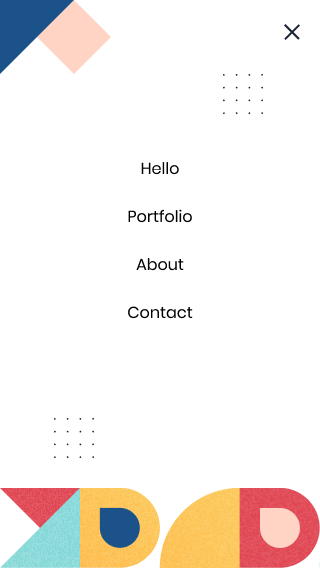

# Milestone 7 - Mobile menu

## Learning objectives

- Use basic JavaScript syntax.
- Use JavaScript to manipulate DOM elements.
- Use JavaScript events.

### Estimated time: 3h

## Description

For this milestone of your portfolio website, you will implement the mobile menu using your recently acquired JavaScript knowledge.

*IMPORTANT NOTE: Read **all** requirements before you start building your project.*

### General requirements

- Make sure that there are [no linter errors](https://github.com/microverseinc/linters-config).
- Make sure that you used correct [GitHub flow](https://github.com/microverseinc/curriculum-transversal-skills/blob/main/git-github/articles/github_flow.md).
- Make sure that you documented your work [in a professional way](https://github.com/microverseinc/curriculum-transversal-skills/blob/main/documentation/articles/professional_repo_rules.md).

### HTML/CSS requirements

- Follow our list of [best practices for HTML & CSS](https://github.com/microverseinc/curriculum-html-css/blob/main/articles/html_css_best_practices.md).

### JavaScript requirements

- Follow our list of [best practices for JavaScript](https://github.com/microverseinc/curriculum-html-css/blob/main/articles/javascript_best_practices.md).

### Project requirements

- In mobile
  - when the user click (or tap) the hamburger button, the mobile menu appears
  - when the user click (or tap) the close (X) button, the mobile menu disappear
  - when the user click (or tap) any option of the mobile menu, the mobile menu disappear
  

    
  

We included a screenshot of Template 5 for reference, but you should follow the template that you chose.

- You must stick to the design as much as possible (e.g., font, colors, images, tests, margins) using [the templates in Figma](https://www.figma.com/file/l7SqJ3ZfkAKih9sFxvWSR4/Microverse-Student-Project-1?node-id=0%3A1).

### Need a big picture?

Remind me about [the big picture of this project](./sneak_peek.md).

## Code review

Follow [these steps](https://github.com/microverseinc/curriculum-transversal-skills/blob/main/code-review/articles/how_to_ask_for_a_code_review.md) to request a code review of your project.

## Submit your project

After the final approval from a code reviewer, you need to submit your project.
[Read this FAQ for a reminder on how to submit your project.](https://microverse.zendesk.com/hc/en-us/articles/360061344234)
Now go to your Student Dashboard and submit your project.

## Additional requirements

*These are all optional, but if you're interested in exploring this topic further, here are some resources to help you. Any exploration here should be done outside program time.*

- In desktop, when the user scrolls you need to check if the user scrolled to a new section. If so, you should highlight the name of the section in the menu manipulating the DOM (using CSS classes).
  

    
  

We included a screenshot of Template 5 for reference, but you should follow the template that you chose.
